# Multiphase Mass-Transfer PDE Solver

Numerical simulation of coupled water–ethanol diffusion and evaporation from a porous spherical sponge into a sealed nitrogen-containing vessel.

The project was developed as part of **Advanced Numerical Methods in Chemical Engineering** at Sharif University of Technology.

## Overview

The model describes transient mass transfer between a liquid-filled porous sponge and the surrounding gas phase.

Water and ethanol diffuse through the sponge, evaporate at the gas–liquid interface, and accumulate in the surrounding gas phase. As evaporation proceeds, the spatial concentration profiles inside the sponge and the gas-phase composition evolve with time.

The numerical framework combines:

- transient diffusion PDEs in spherical coordinates
- coupled gas-phase mass balances
- nonuniform spatial discretization
- gas–liquid equilibrium relationships
- interfacial mass-transfer correlations
- adaptive time stepping
- nonlinear algebraic equation solving
- sparse Jacobian techniques

---

## Physical Model

The liquid phase contains **water and ethanol**, while the gas phase contains:

- water vapor
- ethanol vapor
- nitrogen

The model accounts for spatial concentration gradients inside the porous sponge and dynamic changes in the surrounding gas phase.

The main modeled phenomena include:

- diffusion through the porous liquid-filled region
- evaporation at the sponge surface
- gas–liquid equilibrium
- external gas-phase mass transfer
- changing gas-phase pressure
- species mass conservation

---

## Spatial Discretization

The liquid-phase diffusion equations are discretized in spherical coordinates:

\[
(r,\theta,\phi)
\]

A **nonuniform radial grid** is used to place more computational nodes near the gas–liquid interface, where stronger concentration gradients are expected.

The model also includes:

- zero-gradient conditions at the sponge center
- mixed mass-transfer conditions at the external surface
- angular no-flux conditions
- periodic boundary conditions in the azimuthal direction

---

## Nonlinear Solver

Each implicit time step produces a nonlinear algebraic system.

The system is solved using a custom **limited-memory Broyden method** with:

- numerical Jacobian estimation
- sparse Jacobian column coloring
- custom LU factorization
- limited-memory inverse updates
- line search
- automatic Jacobian reconstruction

The Jacobian coloring strategy allows multiple structurally independent variables to be perturbed simultaneously, reducing the number of residual evaluations required for Jacobian construction.

---

## Adaptive Simulation

The simulation adjusts the time step according to nonlinear solver performance.

The implementation also monitors:

- solver convergence
- non-negative concentrations
- possible drying of liquid species
- gas pressure
- mass conservation
- steady-state behavior

---

# Results

## Liquid-Phase Concentration Distributions

### Ethanol radial concentration profiles

Concentration profiles at selected simulation times illustrate the evolution of ethanol inside the porous sponge.

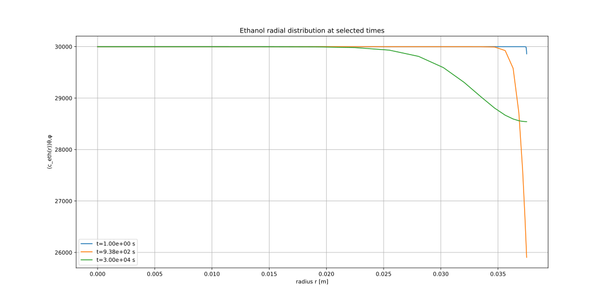

### Water radial concentration profiles

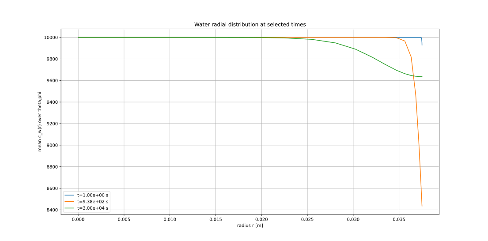

These plots show how concentration gradients develop inside the sponge as mass is transferred toward the gas phase.

---

## Concentration at the Gas–Liquid Interface

The following figure tracks water and ethanol concentrations at the outer radial boundary of the sponge.

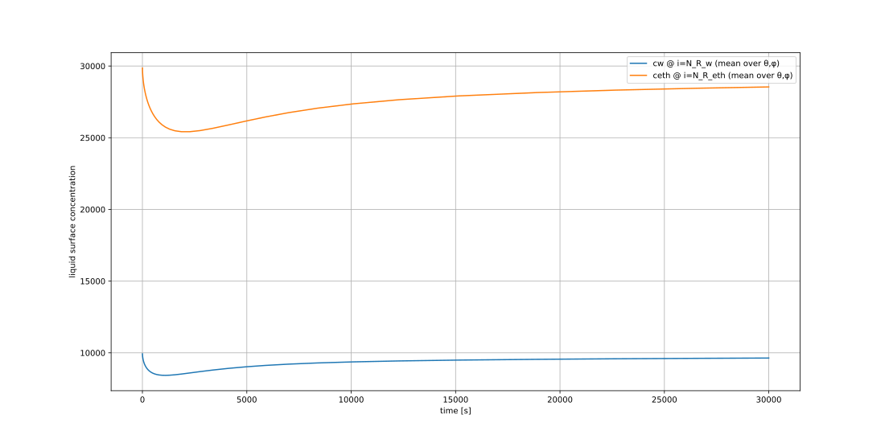

The changing surface composition directly affects gas–liquid equilibrium and the evaporation driving force.

---

# Spatiotemporal Concentration Maps

## Ethanol

### Mean over the azimuthal direction

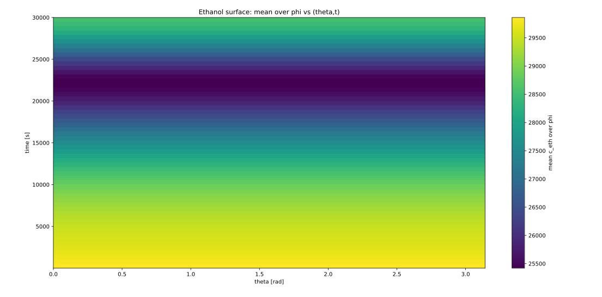

### Mean over the radial direction

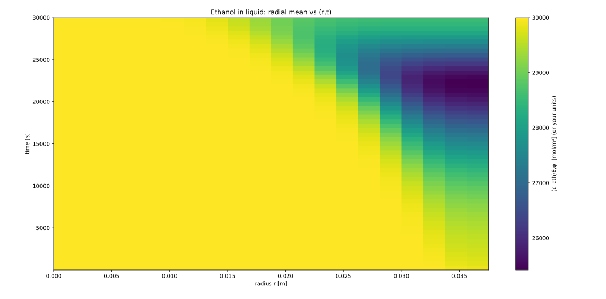

### Mean over the polar-angle direction


These maps provide different projections of the transient ethanol concentration field and help visualize how the spatial distribution changes during evaporation.

---

## Water

### Mean over the azimuthal direction

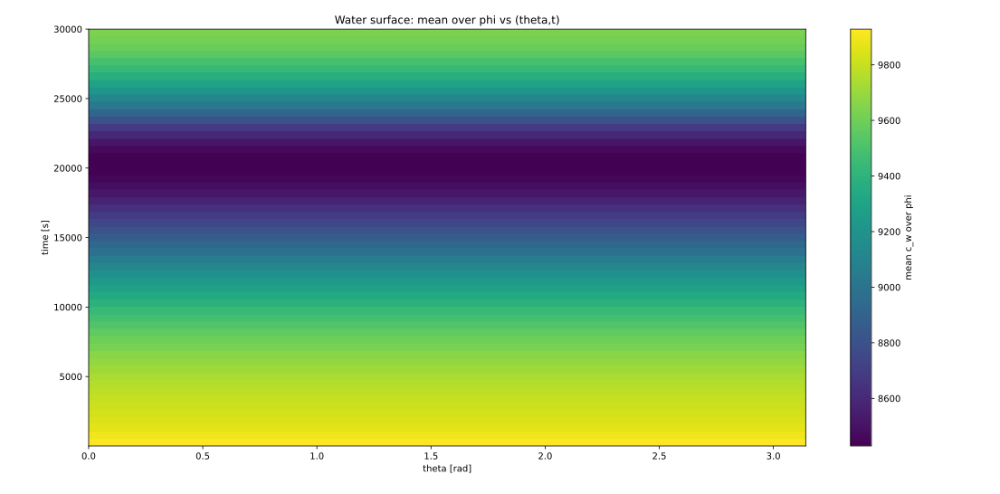

### Mean over the radial direction

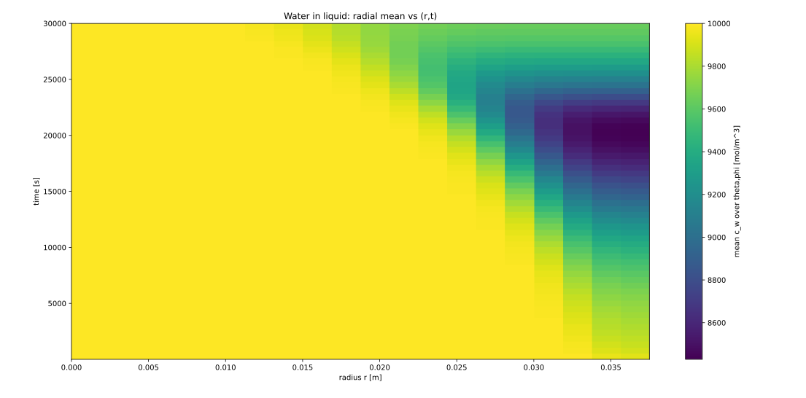

### Mean over the polar-angle direction

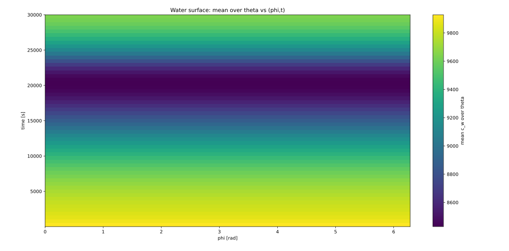

Together, the water and ethanol maps illustrate the coupled evolution of the liquid composition inside the porous medium.

---

# Gas-Phase Dynamics

The surrounding gas initially consists primarily of nitrogen. As evaporation proceeds, water and ethanol accumulate in the gas phase.

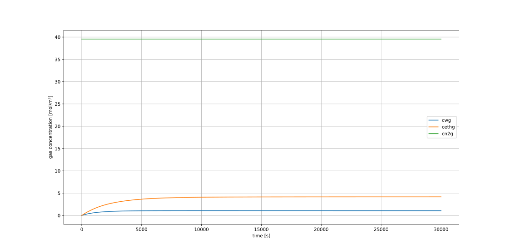

The liquid- and gas-phase models are therefore dynamically coupled through the interfacial mass-transfer equations.

---

## Vessel Pressure

Because the system is sealed, evaporation also changes the total gas concentration and consequently the vessel pressure.

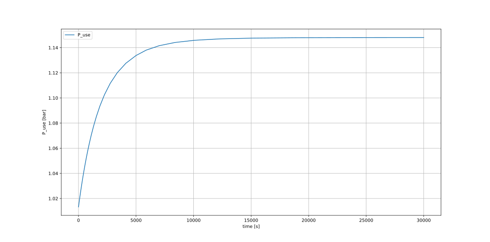

Pressure is evaluated from the evolving total gas concentration using the ideal-gas relationship.

---

# Mass-Conservation Check

Mass conservation is used as an important numerical consistency check.

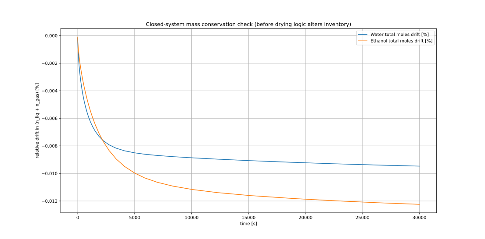

The total number of moles of each volatile species is calculated by combining its amount in the liquid sponge with its amount in the gas phase.

Monitoring the drift from the initial total provides a diagnostic for numerical conservation errors.

---

## Project Structure

```text
multiphase-mass-transfer-pde-solver/
│
├── README.md
├── requirements.txt
│
├── src/
│   ├── main.py
│   ├── broyden_solver.py
│   ├── jacobian_coloring.py
│   ├── numerical_jacobian.py
│   ├── initial_conditions.py
│   ├── interface_thermodynamics.py
│   └── norms.py
│
└── figures/
    ├── Drifts_in_mass_balance.svg
    ├── Ethanol_in_Liq_Heat_Map_Phi_Mean.svg
    ├── Ethanol_in_Liq_Heat_Map_Radial_Mean.svg
    ├── Ethanol_in_Liq_Heat_Map_Tetha_Mean.svg
    ├── Ethanol_Radial_Disturbutions.svg
    ├── ethanol_water_concentration_at_r=R.svg
    ├── ethanol_water_nitrogen_gas_concentration.svg
    ├── P.svg
    ├── W_Dist_Selected_t.svg
    ├── Water_in_Liq_Heat_Map_Phi_Mean.svg
    ├── Water_in_Liq_Heat_Map_Radial_Mean.svg
    └── Water_in_Liq_Heat_Map_Tetha_Mean.svg
```

---

## Technologies

- Python
- NumPy
- Matplotlib
- Finite-difference methods
- Broyden quasi-Newton methods
- Sparse Jacobian coloring
- Numerical linear algebra

---

## Running the Simulation

Install the required packages:

```bash
pip install -r requirements.txt
```

Run:

```bash
python src/main.py
```

The simulation generates transient liquid- and gas-phase concentration data together with diagnostic and visualization results.

---

## Numerical Highlights

This project includes implementations of:

- nonuniform finite-difference discretization in spherical coordinates
- coupled PDE–ODE process modeling
- sparse numerical Jacobian construction
- graph-coloring-based Jacobian compression
- limited-memory Broyden updates
- custom LU factorization
- adaptive time-step management
- dynamic gas–liquid mass-transfer calculations
- mass-conservation diagnostics

---

## Author

**Mohammad Mahdi Saeedi**  
M.Sc. in Chemical Engineering – Modeling, Simulation, and Control  
Sharif University of Technology
